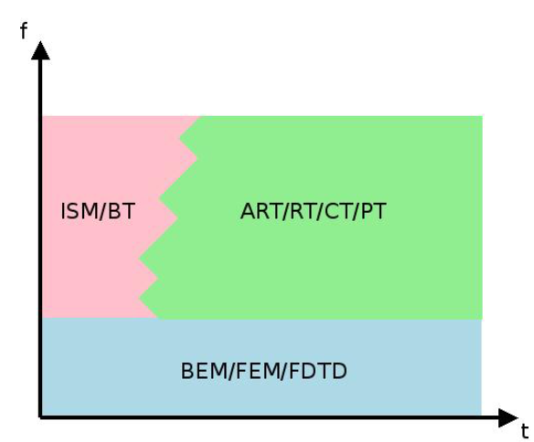
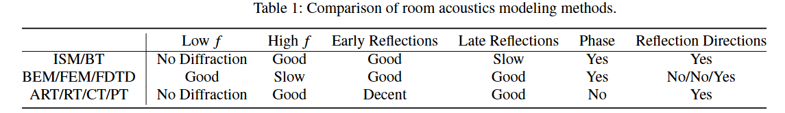

Room Acustics를 시뮬레이션 할 수 있는 방법은 다양하다. 그 종류는 다음의 리서치에서 설명 한 것 과 같다.
[자료](Rays_or_waves_understanding_the_strength.pdf)

우리는 이 곳에서 설명하고 있는 방법 중, RT 방식을 사용하고 있다.

위 자료에 따르면 RT 방식은 고주파, 후기 잔향에 유리한 것을 볼 수 있다.

우리 기술의 문제점
1. 1차 Diffraction만 가능
2. 측정 방식의 부제
3. 성능
4. Auralization 수학적으로 검증되어 있지 않음

